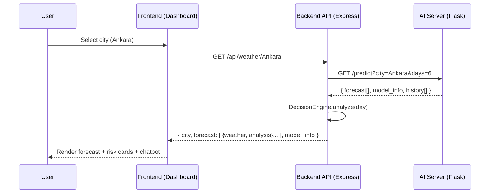

## AgroWeatherAI — Final Project Report

**Project repository:** `weather-prediction-project`  
**System name (UI/Docs):** AgroWeatherAI / AgroWeatherAI: Akıllı Tarımsal Tahmin Sistemi  
**Date:** 2025-12-28

---

## Final Project Overview and Achievements

AgroWeatherAI is an **AI-assisted agricultural decision support system** that turns raw weather forecasts into **actionable, farm-oriented recommendations** (e.g., frost risk, planting suitability, spraying windows, and disease risk). The core achievement is a working, end-to-end pipeline that:

- Produces **localized multi-variable weather forecasts** using a trained **Deep Bidirectional LSTM** model.
- Converts forecast outputs into **agronomic risk assessments** using a deterministic **Decision Engine**.
- Delivers results through a modern **React dashboard** and a simple **rule-based chatbot** for natural-language questions.

The project is intentionally designed as a clean, separable 3-layer system:

- **Frontend** (React/Vite/Tailwind): interactive UI + dashboard + embedded chatbot.
- **Backend** (Node.js/Express/TypeScript): API gateway + domain logic (risk calculations).
- **AI Service** (Python/Flask/TensorFlow/Keras): trained LSTM inference server + dataset-driven forecasting.

---

## Completed Features and System Components

### System Components (What exists in the final system)

- **Frontend UI (`frontend/`)**
  - Location selection (currently **Ankara-only** in UI): `frontend/src/pages/LocationSelect.tsx`
  - Dashboard showing tomorrow-first forecast, model info, and agricultural risk cards: `frontend/src/pages/Dashboard.tsx`
  - Chatbot widget (embedded + floating): `frontend/src/components/ChatWidget.tsx`
  - API client: `frontend/src/services/api.ts`

- **Backend API (`backend/`)**
  - Express server and routing: `backend/src/server.ts`, `backend/src/routes/weather.ts`, `backend/src/routes/chat.ts`
  - Weather aggregation + AI callout + mapping into app domain types: `backend/src/services/WeatherService.ts`
  - Agricultural decision rules (deterministic calculations): `backend/src/services/DecisionEngine.ts`
  - Chat orchestration (intent routing + response templates): `backend/src/services/ChatService.ts`
  - Shared types: `backend/src/types.ts`

- **AI Model & Inference Server (`ai-model/`)**
  - Training pipeline: `ai-model/train_model.py`
  - Inference server: `ai-model/predict_server.py`
  - Dataset: `ai-model/cities.csv`
  - Persisted artifacts (Ankara): `ai-model/weather_lstm_ankara.keras`, `ai-model/scaler_ankara.joblib`, `ai-model/model_metrics_ankara.joblib`

### Runtime topology (ports, endpoints, and dependencies)

- **Frontend (Vite)**: serves the UI (commonly `http://localhost:5173`)
  - Routes: `/` (location selection), `/dashboard` (main view)
  - Calls backend via `frontend/src/services/api.ts` with `API_BASE = http://localhost:3000/api`

- **Backend (Express)**: `http://localhost:3000`
  - `GET /api/weather/:city` → returns `{ forecast[], model_info }`
  - `POST /api/chat` → returns `{ response }`

- **AI Prediction Server (Flask)**: `http://127.0.0.1:5000`
  - `GET /predict?city=<name>&days=<N>` → returns `{ forecast[], model_info, history[] }`
  - `GET /reload` → reloads model/scaler/data into memory

### How the final system works as a whole (End-to-end flow)

At runtime, the system works like this:

1. **User selects a city** in the frontend (UI currently restricts to **Ankara**).
2. The **Dashboard** requests `/api/weather/:city` from the backend.
3. The backend `WeatherService` calls the **AI Prediction Server** at `http://127.0.0.1:5000/predict` (Flask), requesting `days=6`.
4. The AI server produces a **multi-day forecast** (tomorrow onward) by:
   - Building a **90-day look-back window** from historical data (seasonal matching),
   - Scaling inputs with the persisted `MinMaxScaler`,
   - Running the LSTM iteratively to generate future days,
   - Inversely transforming predictions back to real units (°C, %, hPa, mm).
5. The backend maps each forecast day into a `WeatherData` object and runs the `DecisionEngine` to compute:
   - **Frost risk**
   - **Planting suitability**
   - **Spraying suitability**
   - **Disease risk**
   - **GDD** (Growing Degree Days)
6. The backend returns JSON to the frontend; the dashboard renders:
   - A hero card (tomorrow’s forecast),
   - Agricultural risk cards with short explanations,
   - “Model info” (window size, features, training metrics) supplied by the AI server.
7. The **Chatbot** (`/api/chat`) reuses the same forecast context and returns a template-based response (rule-based intent detection).

### AI model and forecasting pipeline (detailed, end-to-end)

This section describes exactly how the AI component works from data to forecast output.

#### Dataset (what the model is trained on)

- **File**: `ai-model/cities.csv`
- **Date range (current repository snapshot)**: 2019-01-01 → 2025-11-01
- **Size (current repository snapshot)**: 24,970 rows across 10 cities; Ankara subset is 2,497 rows.
- **Provenance**: the external source/citation for `cities.csv` is not recorded in this repository; the file itself is treated as the authoritative dataset for this snapshot.
- **Training scope in code**: `train_model.py` filters to `CITY_NAME = 'Ankara'` and trains on **Ankara-only** data.

#### Feature vector (10 dimensions)

The model is multivariate: it learns and predicts multiple atmospheric variables at once.

- **Base meteorological features (8)** (from `FEATURE_COLS`):
  - `daily_avg_temp`
  - `daily_max_temp`
  - `daily_min_temp`
  - `daily_avg_wind_speed`
  - `avg_relative_humidity`
  - `avg_pressure`
  - `precipitation_sum`
  - `rainy_hour_sum`
- **Seasonal time encoding (2)**:
  - `day_sin = sin(2π * day_of_year / 365.25)`
  - `day_cos = cos(2π * day_of_year / 365.25)`

#### Preprocessing and windowing (training)

From `ai-model/train_model.py`:

- **Date handling**: parse `date`, filter to Ankara, sort chronologically.
- **Missing values**: linear interpolation + backward/forward fill.
- **Scaling**: `MinMaxScaler(feature_range=(0, 1))` fitted on the 10D feature matrix.
- **Sliding window supervision**:
  - Input \(X\): previous 90 days → shape `(90, 10)`
  - Target \(y\): next day’s 10D vector
  - Dataset creation yields `X.shape = (num_samples, 90, 10)` and `y.shape = (num_samples, 10)`
  - This is **single-step** training (next-day). Multi-day forecasts are produced **iteratively** at inference time (see next section), not as a direct multi-step \(H×10\) output.
- **Train/validation split**: first 85% train, last 15% validation (time-ordered split).

#### Network architecture (Deep Bi-LSTM)

From `build_deep_model()` in `ai-model/train_model.py`:

- Bidirectional LSTM(128, `return_sequences=True`) → BatchNorm → Dropout(0.3)
- LSTM(128, `return_sequences=True`) → Dropout(0.3)
- LSTM(64, `return_sequences=False`) → BatchNorm → Dropout(0.2)
- Dense(64) → ReLU → Dropout(0.1)
- Dense(32) → ReLU
- Dense(10) output (predicts the next day’s 10D vector)

Training configuration:

- Loss: MSE
- Optimizer: Adam
- Metric logged: MAE (see the unit caveat in **Evaluation and Results**)
- Epochs: 100, Batch size: 32
- Callbacks: EarlyStopping (patience 15), ReduceLROnPlateau (factor 0.5, patience 7, min_lr 1e-5)

#### Inference strategy (“Smart Seasonal Memory” + iterative forecasting)

From `ai-model/predict_server.py`:

- **Smart Seasonal Memory seed selection**
  - The server tries to seed the model with a 90-day window ending around the same calendar period in prior years.
  - It attempts year offsets in order `[2, 3, 4, 5, 1]` (preferring “2 years ago” first).
  - If no prior-year slice contains ≥90 rows, it falls back to the **latest 90 rows** for that city in `cities.csv`.

- **Iterative multi-day forecasting**
  - The initial 90×10 window is scaled and fed to the model.
  - For each future day:
    - Predict the next 10D vector in scaled space.
    - Inverse-transform to physical units.
    - Construct the JSON day forecast.
    - Build the next input row by taking the predicted 8 meteorological values and recomputing deterministic `day_sin/day_cos` for the predicted date.
    - Slide the window forward (drop oldest row, append new row).

- **Returned auxiliary context**
  - `history`: last 7 values of `daily_max_temp` from the seed window (used by the UI for trend context).

#### AI pipeline figure (training → serving → consumption)

```mermaid
flowchart TD
  A[cities.csv] --> B[Preprocess\n(date parse, sort,\ninterpolate missing,\nengineer day_sin/day_cos)]
  B --> C[MinMaxScaler fit/transform]
  C --> D[Sliding windows\nX: 90x10, y: 10]
  D --> E[Train Deep Bi-LSTM\n(Adam + MSE)]
  E --> F[Persist artifacts\n.keras + scaler + metrics]
  F --> G[Flask AI server\n/predict]
  G --> H[Backend WeatherService]
  H --> I[DecisionEngine\n(risk rules)]
  I --> J[Frontend Dashboard + Chatbot]
```

### Backend domain mapping and analysis (what happens after AI returns data)

The backend does two critical transformations before the UI sees results:

1. **AI → App Weather Data mapping**
   - `backend/src/services/WeatherService.ts` converts each AI day output into `WeatherData`.
   - Weather “icon” and “description” are **heuristics** based on predicted precipitation and humidity.
   - `precipitation_prob` is derived as a simple probability (80% vs 10%) rather than predicted directly.

2. **Agronomic analysis via Decision Engine**
   - For each day, `DecisionEngine.analyze(weather)` produces:
     - **Frost risk** (with black frost vs white frost categories)
     - **Planting status** (based on GDD + operational constraints)
     - **Spraying risk** (wind/precipitation/temperature checks)
     - **Disease risk** (humidity + temperature + wetness interaction)
     - **GDD** output

#### Decision Engine rules (current implementation)

From `backend/src/services/DecisionEngine.ts`:

- **Dew point approximation**
  - \(DP \approx T - \frac{100 - RH}{5}\)
  - Note: comments/docs refer to “Magnus”; the shipped code uses the simplified approximation above.

- **Frost risk**
  - **Black frost (EXTREME)** if `minTemp ≤ 0` and `dewPoint ≤ -3` and `(minTemp - dewPoint) > 2`
  - **White frost** buckets if `minTemp ≤ 0` (HIGH at ≤-4, MEDIUM at ≤-2, else LOW)
  - **Near frost** if `minTemp ≤ 2`, else NONE

- **GDD (Growing Degree Days)**
  - \(GDD = \frac{T_{max} + T_{min}}{2} - T_{base}\)
  - Current `T_base = 5` (wheat/cereals assumption), clamped to 0 if negative.

- **Planting suitability**
  - Not suitable if `GDD ≤ 0` OR `temp.day < 5` OR `precipitation_prob > 60` OR `wind_speed > 25`

- **Spraying suitability**
  - Not suitable if `wind_speed > 15` OR `precipitation_prob > 40` OR `temp.day > 30`

- **Disease risk**
  - HIGH if `15 ≤ temp.day ≤ 28` AND `humidity > 80` AND `precipitation_prob > 30`
  - MEDIUM if warm+humid, else LOW

#### Chatbot behavior (intent + templates)

From `backend/src/services/ChatService.ts`:

- The chatbot is **rule-based** (keyword intent routing), not an LLM.
- It always fetches the latest forecast context first (`WeatherService.getForecast(city)`), then answers based on:
  - greetings (“merhaba/selam”)
  - frost (“don/soğuk”)
  - planting (“ekim/fiğ/buğday/tohum”)
  - spraying (“ilaç/gübre”)
  - precipitation (“yağmur/yağış”)
  - disease (“hastalık/mantar”)
  - AI/model questions (“yapay zeka/ai/tahmin/trend/model”)
  - “yarın” questions (uses `forecast[1]`)
  - fallback: summarizes today/tomorrow conditions

### Architecture Figure (Component view)

```mermaid
flowchart LR
  user[User (Farmer/Agronomist)] --> ui[Frontend: React + Vite + Tailwind]

  ui -->|GET /api/weather/:city| api[Backend: Node.js + Express (TypeScript)]
  ui -->|POST /api/chat {message, city}| api

  api -->|GET /predict?city=...&days=6| ai[AI Service: Flask + TensorFlow/Keras]
  ai -->|forecast[], model_info| api

  api --> de[Decision Engine\n(Frost/Planting/Spraying/Disease)]
  de --> api

  ai -->|reads| csv[(cities.csv)]
  ai -->|loads| model[(weather_lstm_ankara.keras)]
  ai -->|loads| scaler[(scaler_ankara.joblib)]
  ai -->|loads| metrics[(model_metrics_ankara.joblib)]
```

### Architecture Figure (Request/response sequence)



---

## Multidisciplinary Collaboration

AgroWeatherAI integrates multiple disciplines because “weather prediction” alone does not solve agricultural problems; the system must convert predictions into **operational decisions** and deliver them through a **usable interface**.

### How disciplines were integrated

- **Data/AI ↔ Software Engineering**: The LSTM model is served as a Flask microservice and consumed by a TypeScript backend, requiring stable API design, reproducible artifacts (`.keras`, scaler), and predictable output schemas.
- **Agronomy/Domain Knowledge ↔ Engineering**: Risk rules (frost/planting/spraying/disease) are encoded into a Decision Engine so domain logic is transparent, testable, and explainable to users.
- **UX/UI ↔ Decision Logic**: The dashboard is designed around farmer questions (“Can I plant/spray?”, “Is there frost?”) rather than meteorology-only metrics.

### Roles and responsibilities of each discipline (as applied in this project)

- **AI / Machine Learning**
  - Build and train the multivariate time-series model (Deep Bi-LSTM).
  - Define feature set, look-back window, training split, and saving of artifacts/metrics.
  - Provide an inference API contract that the backend can depend on.

- **Backend / Platform Engineering**
  - Own the API surface (`/api/weather`, `/api/chat`), error handling, and data contracts.
  - Integrate the AI service and translate raw model outputs into domain objects.
  - Implement deterministic agricultural decision rules for explainability.

- **Frontend / UX Engineering**
  - Deliver the dashboard and interaction model (city selection, embedded chatbot).
  - Present predictions and risk results with clear visual hierarchy and microcopy.
  - Manage client-side state and caching (React Query) for responsive UX.

- **Data Engineering (lightweight, file-based)**
  - Maintain and validate the historical dataset (`cities.csv`) and feature columns.
  - Ensure date parsing and continuity for time-series windows.

- **Quality / Validation**
  - Manual validation of the full flow (UI → API → AI → DecisionEngine → UI).
  - Sanity-check of outputs and edge cases (missing AI server, insufficient history).

---

## Disciplinary Contributions to the Final Solution

### Design (UX + information design)

- **User-centered outputs**: the dashboard is structured around actionable outcomes (risk cards) instead of raw meteorological charts.
- **Explainability**: risk cards include short explanations, and the system exposes “model info” to improve transparency.
- **Interaction model**: persistent city selection via `localStorage` and a chatbot entry point for quick questions.

### Development (implementation across layers)

- **Frontend development**
  - Two-route UI (`/` → `LocationSelect`, `/dashboard` → `Dashboard`) with React Router.
  - Data fetching/caching (`@tanstack/react-query`) with a 5-minute refetch cadence.
  - Chat widget with optimistic UX (pending state, error fallback).

- **Backend development**
  - Weather API endpoint: `GET /api/weather/:city`
  - Chat API endpoint: `POST /api/chat`
  - AI integration: `WeatherService` calls Flask and performs strict validation on returned data.

- **AI service development**
  - Flask endpoint: `GET /predict` returning forecast + model_info + recent-history slice.
  - Iterative multi-day prediction using the LSTM output as the next input window.

### Analysis (modeling + domain rules)

- **Time-series feature engineering**
  - 8 meteorological features + 2 cyclical seasonal encodings (`day_sin`, `day_cos`) → 10D input vector.
  - Sliding-window framing: 90 days input → next day output (multivariate).

- **Agronomic decision analysis**
  - The Decision Engine converts forecast values to domain outcomes:
    - Frost classification (including “black frost” vs “white frost”)
    - Planting suitability using GDD and operational constraints
    - Spraying suitability using wind/precipitation/temperature constraints
    - Disease risk from humidity/temperature/precipitation interactions

### Testing (current state and validation approach)

- **Automated tests**: no unit/integration test suite is currently present in the repository.
- **Runtime validations implemented**
  - Backend verifies AI response structure and fails with a user-facing error message if the AI server is unavailable.
  - Frontend presents explicit loading/error UI states and avoids rendering when data is missing.

---

## Evaluation and Results

### Model metrics (as persisted by training)

The repository includes saved training metrics at `ai-model/model_metrics_ankara.joblib`:

- **Architecture**: Deep Bidirectional LSTM
- **Look-back window**: 90 days
- **Feature dimension**: 10
- **Epochs trained**: 100
- **Validation MAE**: 0.0544142425
- **Validation loss (MSE)**: 0.0062041269

### Important note about metric units (strengths + limitation)

The model is trained on **MinMax-scaled** features (`MinMaxScaler(feature_range=(0,1))`). The saved `val_mae` and `val_loss` are therefore computed in **scaled space** (0–1), not directly in **°C** or other physical units. The dashboard currently displays this MAE as if it were “±X °C”; that is a **unit mismatch**.

**Recommended validation method (future improvement):**

- Inverse-transform predictions and targets back to original units, then compute MAE/RMSE for the specific variables that matter (e.g., `daily_max_temp`, `daily_min_temp`), and optionally per-season.

### System-level validation (what the running system guarantees)

- **Explainability**: The Decision Engine provides deterministic, human-readable messages for risks, which can be inspected and updated independently of the model.
- **Fault tolerance (basic)**: If the AI server is unreachable, the backend returns a clear error (“AI servisine ulaşılamıyor…”) and the frontend renders a retry screen.

### Strengths and limitations

- **Strengths**
  - Clear separation of concerns: AI inference is isolated from decision logic and UI.
  - Forecast is **multivariate** (temp/wind/humidity/pressure/precipitation), enabling richer downstream risk logic than temperature-only models.
  - “Smart Seasonal Memory” strategy increases seasonal coherence by seeding the model with historical windows aligned to the current date.

- **Limitations**
  - **City coverage is constrained**: UI supports only Ankara; model/scaler artifacts are Ankara-specific.
  - **Metrics displayed in UI are not fully trustworthy** without unit-correct post-scaling evaluation.
  - **Decision rule consistency**: documents mention different GDD base temperature assumptions than the current `DecisionEngine` implementation; this should be aligned for scientific clarity.
  - **No automated tests**: correctness is not protected by CI tests at the moment (CI runs ESLint + spellcheck only).

---

## Conclusion and Future Work

AgroWeatherAI delivers a complete, working prototype that bridges AI forecasting and agricultural decision-making in a user-friendly product. The core value is **actionability**: instead of “the weather,” users receive **farm decisions** backed by both a learned model and explainable rules.

### Future work (highest impact next steps)

- **Unit-correct evaluation**: compute MAE/RMSE in real units after inverse scaling and report per-variable metrics.
- **Multi-city expansion**: train and ship model/scaler artifacts for all cities present in `cities.csv` and open up the UI to select them safely.
- **Decision Engine hardening**: align agronomic constants (e.g., GDD base temperature) with chosen crop profiles and document them consistently.
- **Automated testing**
  - Unit tests for `DecisionEngine` (threshold logic, edge cases).
  - Contract tests for AI server responses (schema + bounds).
  - Lightweight integration test for `/api/weather/:city`.
- **Operational readiness**
  - Central configuration for service URLs (avoid hard-coded localhost endpoints).
  - Health checks for AI server and backend.
  - Containerization (Docker) for consistent deployment across machines.


